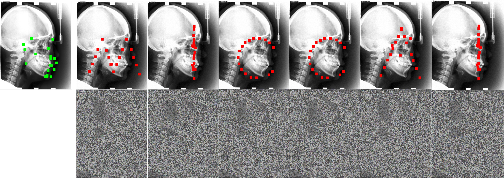

# Miss the Point: Targeted Adversarial Attack on Multiple Landmark Detection

by Qingsong Yao, Zecheng He, Hu Han, and S. Kevin Zhou

The source code of paper "Miss the Point: Targeted Adversarial Attack on Multiple Landmark Detection" accepted by MICCAI 2020.

## Abstruct
 Recent methods in multiple landmark detection based on deep convolutional neural networks (CNNs) reach high accuracy and improve traditional clinical workflow. However, the vulnerability of CNNs to adversarial-example attacks can be easily exploited to break classification and segmentation tasks. This paper is the first to study how fragile a CNN-based model on multiple landmark detection to adversarial perturbations. Specifically, we propose a novel Adaptive Targeted Iterative FGSM (ATI-FGSM) attack against the state-of-the-art models in multiple landmark detection. The attacker can use ATI-FGSM to precisely control the model predictions of arbitrarily selected landmarks, while keeping other stationary landmarks still, by adding imperceptible perturbations to the original image. A comprehensive evaluation on a public dataset for cephalometric landmark detection demonstrates that the adversarial examples generated by ATI-FGSM breaks the CNN-based network more effectively and efficiently, compared with the original Iterative FGSM attack. Our work reveals serious threats to patients’ health. Furthermore, we discuss the limitations of our method and provide potential defense directions, by investigating the coupling effect of nearby landmarks, i.e., a major source of errors in our experiments.

## Fancy Attack


## Get features from VGG19
```
cp container.py venv/lib/python3.6/site-packages/torch/nn/modules
```
We add another arg to torch.nn.Sequitial.
This change will not cause other conficts.

## Prepare Dataset
 Downlaod the dataset of cephalometric landmark detection, provided in IEEE ISBI 2015 Challenge. [Download](http://www-o.ntust.edu.tw/~cweiwang/ISBI2015/challenge1/)
Rename it as $home/dataset

## Train the multi-task U-Net
```
CUDA_VISIBLE_DEVICES=0 python train.py --tag baseline
```

## Test the performance of our U-Net
```
CUDA_VISIBLE_DEVICES=0 python test.py --tag baseline --iteration 229
```

## Attack the Victimized U-Net
```
CUDA_VISIBLE_DEVICES=0 python test.py --tag baseline --iteration 229 --attack 1 --rand temp
```
The performance (csv and line chart) will be saved in $home/temp.

The FGSM and ATI-FGSM are implenmented in attack.py.
The functions in charge of counting results are implenmented in eval.py.

## Citation
If our work is useful to you, please cite our paper as:
```
@artical{qsyao2020landmarkattack,
  title={Miss the Point: Targeted Adversarial Attack on Multiple Landmark Detection},
  author={Qingsong Yao, Zecheng He, Hu Han, and S. Kevin Zhou},
  booktitle={International Conference on Medical Image Computing and Computer-Assisted Intervention},
  year={2020}
}
```
